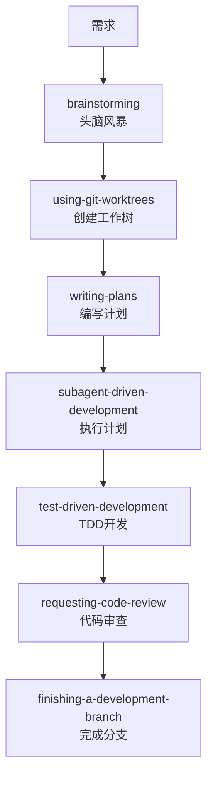

# 第一章：Superpowers 简介

## 什么是 Superpowers？

Superpowers 是一套为 AI 编码代理打造的完整软件开发工作流系统。它基于一组可组合的"技能"（skills）构建，通过初始指令确保你的代理能够正确使用这些技能。

简单来说，Superpowers 让你的 AI 编码代理变得更聪明、更可靠、更高效。

## 核心理念

传统的 AI 编码代理往往存在一些问题：

- **直接跳入编码**：没有经过充分的思考和规划
- **缺乏系统性**：随机试错而不是系统化调试
- **忽视测试**：先写代码再补测试，甚至不写测试
- **复杂度失控**：过度设计，写了很多不必要的代码
- **缺乏验证**：声称完成了，但实际并未真正解决问题

Superpowers 通过强制的工作流程来解决这些问题。

## 工作原理

Superpowers 的工作流程从你启动编码代理的那一刻就开始了。

### 1. 需求澄清

当代理看到你要构建某些东西时，它**不会**立即尝试编写代码。相反，它会退一步，询问你真正想要做什么。

```
用户：帮我写一个用户登录功能
代理：好的，在我们开始编码之前，让我先了解一些细节...
      - 这个登录功能支持哪些登录方式？（用户名/密码、OAuth、手机验证码？）
      - 需要记住登录状态吗？持续多久？
      - 密码有什么复杂度要求吗？
      - 需要登录失败次数限制吗？
      ...
```

### 2. 规格设计

一旦从对话中提取出了规格说明，代理会将其分成足够短的片段展示给你，让你能够真正阅读和消化。

这确保了你理解并认可将要构建的内容，避免了方向性的错误。

### 3. 实施计划

在你批准设计后，代理会制定一个实施计划。这个计划足够清晰，以至于一个热情但缺乏判断力、没有项目背景、厌恶测试的初级工程师也能遵循。

计划强调：
- **真正的红/绿 TDD**（测试驱动开发）
- **YAGNI**（你不会需要它）
- **DRY**（不要重复自己）

### 4. 子代理驱动开发

一旦你说"开始"，代理会启动一个 *subagent-driven-development*（子代理驱动开发）进程：

1. 为每个工程任务分配一个独立的子代理
2. 子代理执行任务
3. 主代理审查工作成果
4. 继续推进

通常，Claude 可以自主工作数小时而不会偏离你们一起制定的计划。

### 5. 持续验证

在整个过程中，代理会：
- 在声称完成之前运行验证命令
- 确保测试通过
- 检查代码质量
- 验证是否符合原始计划

## 核心价值观

Superpowers 建立在以下核心价值观之上：

### 测试驱动开发

**永远先写测试**。这不是建议，是强制要求。

```
❌ 错误：先写代码，再补测试
✅ 正确：先写失败测试，看它失败，写最小代码，看它通过
```

### 系统化优于随机

使用系统化的流程，而不是随机猜测。

```
❌ 错误：试试这个...不行，试试那个...也不行...
✅ 正确：重现问题 → 分析根本原因 → 制定修复计划 → 验证修复
```

### 简化为首要目标

复杂性是敌人。简单性应该作为主要目标。

```
❌ 错误：让我们为未来的需求预留扩展点
✅ 正确：YAGNI - 你不会需要它。只写现在需要的功能
```

### 证据优于声明

在宣布成功之前，验证它确实工作。

```
❌ 错误：我觉得应该修好了
✅ 正确：运行测试，确认输出，验证修复
```

## 主要功能

### 🎯 自动触发

你不需要做任何特殊操作。技能会自动触发。你的编码代理只是有了 Superpowers。

### 📚 技能库

Superpowers 包含丰富的技能库：

**测试相关**
- `test-driven-development` - 红-绿-重构循环

**调试相关**
- `systematic-debugging` - 四阶段根本原因分析流程
- `verification-before-completion` - 确保真正修复完成

**协作相关**
- `brainstorming` - 苏格拉底式设计细化
- `writing-plans` - 详细的实施计划
- `executing-plans` - 带检查点的批量执行
- `dispatching-parallel-agents` - 并发子代理工作流
- `requesting-code-review` - 预审查检查清单
- `receiving-code-review` - 响应反馈
- `using-git-worktrees` - 并行开发分支
- `finishing-a-development-branch` - 合并/PR 决策工作流
- `subagent-driven-development` - 快速迭代与双阶段审查

**元技能**
- `writing-skills` - 创建新技能的最佳实践
- `using-superpowers` - 技能系统介绍

## 基本工作流

Superpowers 定义了一个标准的开发工作流：



每个阶段都有对应的技能自动触发，确保流程的正确执行。

## 谁在使用 Superpowers？

Superpowers 适用于所有使用 AI 编码代理的开发者：

- **个人开发者**：提升个人开发效率和代码质量
- **团队**：统一开发流程，确保代码质量一致
- **企业**：标准化 AI 辅助开发，降低风险

## 社区与支持

Superpowers 是一个开源项目，由 [Jesse Vincent](https://blog.fsck.com) 和 [Prime Radiant](https://primeradiant.com) 团队构建。

- **Discord 社区**：[加入 Discord](https://discord.gg/Jd8Vphy9jq)
- **GitHub Issues**：https://github.com/obra/superpowers/issues
- **市场**：https://github.com/obra/superpowers-marketplace

## 下一步

在下一章中，我们将学习如何在不同的平台上安装和配置 Superpowers，包括：
- Claude Code
- Cursor
- Codex
- OpenCode
- Gemini CLI

---

## 参考资源

- [Superpowers 官方博客](https://blog.fsck.com/2025/10/09/superpowers/)
- [GitHub 仓库](https://github.com/obra/superpowers)
- [赞助开源工作](https://github.com/sponsors/obra)
