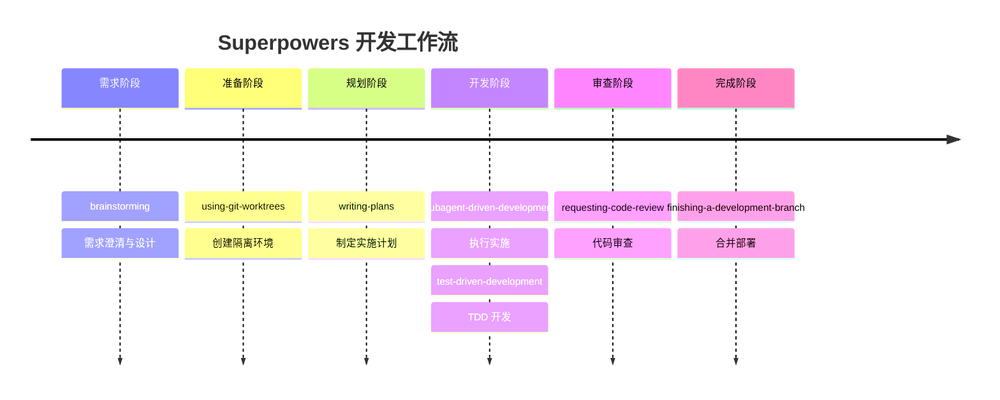

# 第四章：工作流深入理解

本章将深入理解 Superpowers 的完整工作流程，学习如何在实际项目中应用。

## 标准工作流程

Superpowers 定义了一个从需求到部署的完整流程：



## 阶段详解

### 阶段 1: 需求澄清 (brainstorming)

**目的**: 确保理解用户真实需求

**关键活动**:
- 苏格拉底式提问
- 探索不同方案
- 分段确认设计
- 生成设计文档

**输出**: 清晰的设计文档

### 阶段 2: 环境隔离 (using-git-worktrees)

**目的**: 创建干净的工作环境

**关键活动**:
- 创建新分支
- 设置工作树
- 验证测试基线

**输出**: 干净的隔离工作环境

### 阶段 3: 计划制定 (writing-plans)

**目的**: 将设计转化为可执行任务

**关键活动**:
- 分解任务
- 为每个任务编写详细步骤
- 指定文件路径
- 包含完整代码
- 定义验证方式

**输出**: 详细的实施计划

### 阶段 4: 执行实施 (subagent-driven-development)

**目的**: 高质量地执行计划

**关键活动**:
- 为每个任务创建子代理
- 执行任务
- 两阶段审查
- 继续下一任务

**输出**: 完成的功能代码

### 阶段 5: 测试驱动 (test-driven-development)

**目的**: 确保代码质量

**关键活动**:
- RED: 编写失败测试
- GREEN: 最小实现
- REFACTOR: 重构优化

**输出**: 经过测试的代码

### 阶段 6: 代码审查 (requesting-code-review)

**目的**: 获得他人反馈

**关键活动**:
- 自我审查
- 提交审查
- 响应反馈

**输出**: 通过审查的代码

### 阶段 7: 合并部署 (finishing-a-development-branch)

**目的**: 安全地集成代码

**关键活动**:
- 最终验证
- 合并策略选择
- 清理工作树

**输出**: 集成到主分支的代码

## 实际案例：用户认证功能

让我们通过一个实际案例来看完整流程。

### 需求

"我想实现一个用户登录功能"

### 流程演示

#### 步骤 1: brainstorming

```
代理：好的，让我问几个问题：

1. 支持哪些登录方式？
   用户：用户名/密码就够了

2. 需要记住登录状态吗？
   用户：需要，保持 7 天

3. 安全要求？
   用户：密码要加密，登录失败 5 次锁定

好的，我理解了。让我展示设计方案...
```

#### 步骤 2: using-git-worktrees

```bash
代理：让我创建一个干净的工作环境

$ git worktree add .worktrees/user-auth feature/user-auth
$ cd .worktrees/user-auth
$ npm install
$ npm test

✓ 测试基线正常，工作环境就绪
```

#### 步骤 3: writing-plans

```markdown
代理：这是实施计划

## 任务 1: 创建 User 模型
**文件**: src/models/User.ts
**代码**: ...
**验证**: TypeScript 编译
**时间**: 10 分钟

## 任务 2: 实现密码哈希
**文件**: src/utils/password.ts
**测试**: password.test.ts
**代码**: ...
**验证**: npm test
**时间**: 15 分钟

... 更多任务
```

#### 步骤 4: subagent-driven-development

```
代理：开始执行计划

[子代理 1] 正在执行任务 1: 创建 User 模型...
✓ 规格合规性检查通过
✓ 代码质量检查通过

[子代理 2] 正在执行任务 2: 实现密码哈希...
✓ 测试通过
✓ 规格合规性检查通过
✓ 代码质量检查通过

... 继续执行
```

#### 步骤 5: verification-before-completion

```
代理：让我验证所有功能

$ npm test
✓ 所有测试通过

$ npm run build
✓ 构建成功

手动测试登录功能：
✓ 可以正常登录
✓ 密码加密正常
✓ 登录状态保持正常
```

#### 步骤 6: requesting-code-review

```
代理：功能已完成，让我提交代码审查

[审查检查清单]
✓ 测试覆盖率 > 80%
✓ 无 TypeScript 错误
✓ 遵循编码规范
✓ 文档已更新

提交审查请求...
```

#### 步骤 7: finishing-a-development-branch

```
代理：审查通过，准备合并

选项：
1. 直接合并到 main
2. 创建 Pull Request
3. 保持分支，稍后处理
4. 放弃更改

用户：创建 PR

代理：好的，正在创建 Pull Request...
✓ PR 已创建: https://github.com/.../pull/123
```

## 常见场景模式

### 场景 1: 简单功能

```
brainstorming → writing-plans → test-driven-development
→ verification-before-completion
```

适用于：添加小功能、简单修改

### 场景 2: 复杂功能

```
brainstorming → using-git-worktrees → writing-plans
→ subagent-driven-development → requesting-code-review
→ finishing-a-development-branch
```

适用于：大型功能、架构变更

### 场景 3: Bug 修复

```
systematic-debugging → test-driven-development
→ verification-before-completion
```

适用于：问题修复

### 场景 4: 重构

```
brainstorming → writing-plans → test-driven-development
→ requesting-code-review
```

适用于：代码重构、性能优化

## 流程关键原则

### 1. 不要跳过步骤

每个步骤都有其价值。看似浪费时间，实际上节省了返工成本。

### 2. 证据优于假设

```
❌ "应该没问题了"
✅ "测试运行结果：所有测试通过"
```

### 3. 保持小步前进

大任务分解为小任务，每个任务 2-5 分钟。

### 4. 先测试，后实现

永远遵循 TDD，没有例外。

## 常见问题

### Q: 流程会不会太慢？

A: 短期看可能慢，但长期看节省了大量返工时间。

### Q: 小功能也要完整流程吗？

A: 可以简化流程，但核心步骤（brainstorming、测试、验证）不能省。

### Q: 如何处理紧急需求？

A: 即使紧急，也要遵循核心步骤。可以在 verification 后快速合并。

## 最佳实践总结

1. **信任流程** - 每个步骤都经过精心设计
2. **小步快跑** - 分解任务，逐步推进
3. **持续验证** - 在每个阶段都验证成果
4. **保持简单** - YAGNI，不要过度设计
5. **证据为王** - 用实际运行结果验证，不用"感觉"

## 下一步

下一章我们将学习 Superpowers 的设计文档，理解其背后的设计思想。
