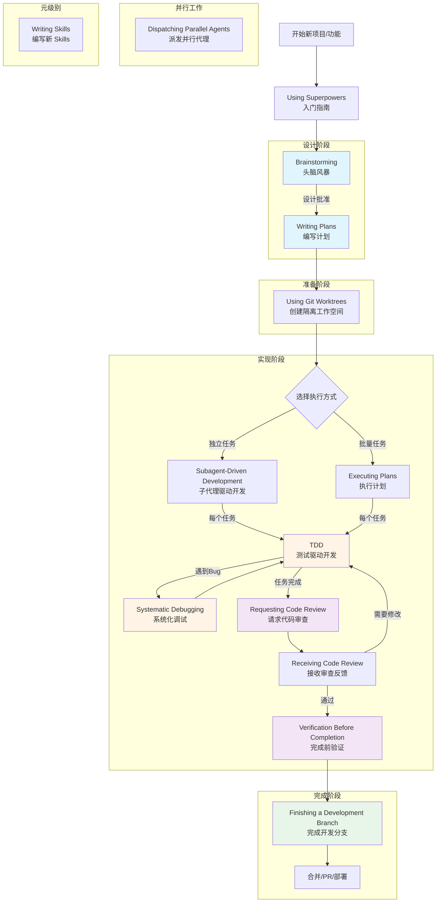
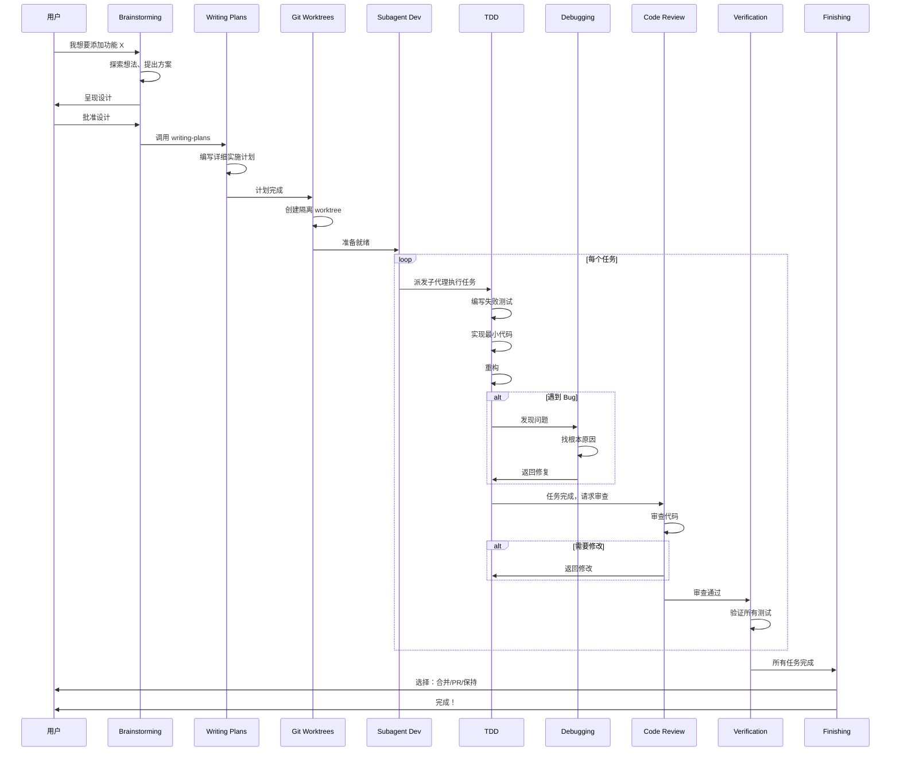

# 第十一章：Skills 编写指南

本章将完整展示 Superpowers 系统中所有 14 个核心 Skills 的原文内容（中文翻译），帮助你学习它们的编写方法和设计思路。

## Superpowers Skills 关系图谱

Superpowers 是一套完整的软件开发工作流系统，所有 Skills 相互配合，形成一个从想法到部署的完整流程。

### 完整工作流程图



### Skills 分类关系

| 分类 | Skills | 作用 | 使用时机 |
|------|--------|------|---------|
| **🔍 入门与元** | Using Superpowers, Writing Skills | 入门指导、扩展系统 | 开始时、需要新技能时 |
| **💡 设计阶段** | Brainstorming, Writing Plans | 探索想法、规划实施 | 实现之前 |
| **🛠️ 准备阶段** | Using Git Worktrees | 创建隔离环境 | 开始实现前 |
| **⚙️ 实现阶段** | TDD, Systematic Debugging, Subagent-Driven Development, Executing Plans | 编写代码、调试、执行计划 | 实现过程中 |
| **🔍 质量保证** | Verification Before Completion, Requesting/Receiving Code Review | 验证质量、代码审查 | 完成前 |
| **✅ 完成阶段** | Finishing a Development Branch | 合并、部署、清理 | 完成后 |
| **🚀 并行工作** | Dispatching Parallel Agents | 并行处理独立问题 | 需要并行时 |

### 典型开发流程示例

以下是一个典型功能开发的完整流程：



### 核心依赖关系

::: info Skills 之间的调用关系

**强制性依赖：**
- **Brainstorming** → **Writing Plans**：设计完成后必须编写计划
- **Writing Plans** → **Using Git Worktrees**：计划完成后需要隔离环境
- **Using Git Worktrees** → **Subagent-Driven Development / Executing Plans**：需要工作空间
- **Subagent-Driven Development** → **TDD**：每个任务都遵循 TDD
- **Executing Plans** → **TDD**：每个任务都遵循 TDD
- **TDD** → **Verification**：完成前必须验证
- **Verification** → **Finishing**：验证后才能完成

**可选性依赖：**
- **TDD** → **Systematic Debugging**：遇到 Bug 时使用
- **任何实现** → **Dispatching Parallel Agents**：独立问题可并行
- **任何任务** → **Requesting Code Review**：需要审查时使用
- **Code Review** → **Receiving Code Review**：接收反馈

**元级别：**
- **Using Superpowers** - 整个系统的入口指南
- **Writing Skills** - 扩展系统，创建新 Skills

:::

### 阶段详解

#### 🎯 Phase 1: 设计阶段

**Brainstorming → Writing Plans**

这是将想法转化为可执行计划的过程：

1. **Brainstorming（头脑风暴）**
   - 探索用户意图和需求
   - 提出 2-3 种方法
   - 呈现设计并获得批准
   - **输出：** 设计文档（spec）

2. **Writing Plans（编写计划）**
   - 将设计转化为详细的实施计划
   - 每个步骤都有具体代码示例
   - 无占位符，无模糊描述
   - **输出：** 实施计划（plan）

#### 🔧 Phase 2: 实现阶段

**Using Git Worktrees → Execution Skills → TDD/Debugging**

执行计划并编写高质量代码：

1. **Using Git Worktrees（创建工作空间）**
   - 创建隔离的 git worktree
   - 验证测试基线
   - **输出：** 准备好的工作空间

2. **执行方式选择**
   - **Subagent-Driven Development**：独立任务，每个任务派发新子代理
   - **Executing Plans**：批量执行，在同一会话中
   - **Dispatching Parallel Agents**：独立问题并行处理

3. **TDD（测试驱动开发）**
   - RED：编写失败测试
   - GREEN：最小代码通过
   - REFACTOR：清理优化
   - **循环执行**

4. **Systematic Debugging（系统化调试）**
   - 遇到 Bug 时使用
   - 四阶段：根本原因 → 模式分析 → 假设测试 → 实施

#### ✅ Phase 3: 质量保证

**Code Review → Verification**

确保代码质量符合要求：

1. **Requesting Code Review（请求代码审查）**
   - 完成任务后请求
   - 派发审查子代理

2. **Receiving Code Review（接收审查反馈）**
   - 技术验证
   - 理性反驳（如果需要）

3. **Verification Before Completion（完成前验证）**
   - 运行所有测试
   - 确认输出干净
   - **必须看到证据**

#### 🚀 Phase 4: 完成阶段

**Finishing a Development Branch**

集成工作并清理：

1. **Finishing（完成）**
   - 验证测试通过
   - 提供 4 个选项（合并/PR/保持/丢弃）
   - 清理 worktree

### 并行与分支

**Dispatching Parallel Agents** 是独立的并行工作模式：

- 用于处理多个独立问题
- 每个问题派发独立代理
- 代理之间无共享状态
- 最后整合结果

**何时使用：**
- 3+ 测试文件因不同原因失败
- 多个子系统独立损坏
- 问题之间无依赖关系

---

::: tip 学习建议
每个 Skill 都是独立的小节，包含：
1. **基本信息** - 用途、核心原则、文件位置
2. **完整原文** - 点击展开查看完整的 SKILL.md（中文翻译）
3. **设计分析** - 关键设计点的注释和分析
4. **可以学习的技巧** - 清单列表

建议按照上面的流程图顺序阅读，从 **Brainstorming** 开始。
:::

## 11.1 Skills 编写概述

### 什么是 Skill？

Skill 是一套经过验证的技术、模式或工具的参考指南。它帮助未来的 AI 代理找到并应用有效的方法。

**Skills 是：**
- ✅ 可重用的技术
- ✅ 模式和方法论
- ✅ 工具和参考指南

**Skills 不是：**
- ❌ 一次性的问题解决叙述
- ❌ 项目特定的约定

### 核心设计原则：TDD for Skills

::: warning 铁律

```
没有失败测试就不能有 Skill
```

:::

编写 Skills 就是将 TDD 应用于流程文档：RED（记录基线）→ GREEN（编写 skill）→ REFACTOR（堵住漏洞）

---

## 11.2 Brainstorming（头脑风暴）

### 11.2.1 基本信息

| 项目 | 内容 |
|------|------|
| **用途** | 在任何创造性工作之前使用 |
| **核心原则** | 必须在呈现设计并获得用户批准后，才能进行任何实现操作 |
| **文件位置** | `skills/brainstorming/SKILL.md` |

### 11.2.2 完整原文（中文）

:::: details 📄 点击展开 SKILL.md 完整内容

**name:** brainstorming
**description:** 你必须在进行任何创造性工作之前使用此技能

# 将想法头脑风暴成设计

通过自然的协作对话帮助将想法转化为完整的设计和规格。

<HARD-GATE>
在呈现设计并获得用户批准之前，不要调用任何实现技能、编写任何代码或采取任何实现行动。
</HARD-GATE>

## 检查清单

1. **探索项目上下文** — 检查文件、文档、最近的提交
2. **提供视觉伴侣**（如果需要）
3. **询问澄清问题** — 一次一个
4. **提出 2-3 种方法** — 带权衡
5. **呈现设计** — 分段呈现
6. **编写设计文档** — 保存并提交
7. **规格自检**
8. **用户审查书面规格**
9. **过渡到实现** — 调用 writing-plans

## 关键原则

- **一次一个问题**
- **首选多选题**
- **无情地 YAGNI**
- **探索替代方案**
- **增量验证**

----

::::

### 11.2.3 设计分析

::: info 💡 关键设计点
- 使用 `<HARD-GATE>` 标签突出绝对规则
- 提供反模式部分，预先解决合理化
- 使用流程图展示决策流程
- 明确终端状态（只能调用 writing-plans）
:::

### 11.2.4 可以学习的技巧

✅ 使用 HTML 标签突出重要约束
✅ 分阶段 checklist，强制顺序执行
✅ 明确终端状态，防止错误的技能调用

---

## 11.3 Test-Driven Development（测试驱动开发）

### 11.3.1 基本信息

| 项目 | 内容 |
|------|------|
| **用途** | 在实现任何功能或修复 bug 之前使用 |
| **核心原则** | 如果没有看到测试失败，你就不知道它是否测试了正确的东西 |

### 11.3.2 完整原文（中文）

:::: details 📄 点击展开 SKILL.md 完整内容

**name:** test-driven-development
**description:** 在编写实现代码之前使用

# 测试驱动开发（TDD）

## 铁律

```
没有失败测试就不能有生产代码
```

在测试之前编写代码？删除它。重新开始。

**无例外：**
- 不要将其保留为"参考"
- 删除意味着删除

## Red-Green-Refactor

**RED - 编写失败测试**

::: tip ✅ Good
```typescript
test('重试失败操作 3 次', async () => {
  // ...测试代码
});
```
名称清晰，测试真实行为
:::

::: warning ❌ Bad
```typescript
test('重试工作', async () => {
  // ...测试代码
});
```
名称模糊，测试模拟而非代码
:::

## 常见合理化

| 借口 | 现实 |
|--------|---------|
| "太简单无法测试" | 简单代码会崩溃。测试需要 30 秒。 |
| "我会在之后测试" | 立即通过的测试证明不了什么。 |

## 红旗

- 测试之前有代码
- 测试立即通过

**所有意味着：删除代码。用 TDD 重新开始。**

----

::::

### 11.3.3 设计分析

::: info 💡 关键设计点
- 铁律 + 无例外列表
- Good/Bad 对比示例
- 合理化预防表
- 红旗列表
- Verification Checklist
:::

### 11.3.4 可以学习的技巧

✅ 使用代码块突出铁律
✅ Good/Bad 容器对比示例
✅ 合理化预防表
✅ 红旗列表

---

## 11.4 Systematic Debugging（系统化调试）

### 11.4.1 基本信息

| 项目 | 内容 |
|------|------|
| **用途** | 在遇到任何 bug、测试失败或意外行为时使用 |
| **核心原则** | 在尝试修复之前必须找到根本原因 |

### 11.4.2 完整原文（中文）

:::: details 📄 点击展开 SKILL.md 完整内容

**name:** systematic-debugging
**description:** 在遇到任何 bug 时使用，在提出修复建议之前使用

# 系统化调试

## 铁律

```
没有根本原因调查就不能有修复
```

## 四个阶段

### Phase 1: 根本原因调查

1. **仔细阅读错误消息**
2. **一致地复现**
3. **检查最近的更改**
4. **在多组件系统中收集证据**

### Phase 2: 模式分析

1. 找到工作示例
2. 与参考对比
3. 识别差异

### Phase 3: 假设与测试

1. 形成单一假设
2. 最小测试
3. 验证后再继续

### Phase 4: 实施

1. 创建失败的测试用例
2. 实施单一修复
3. 验证修复

**如果 ≥ 3 次修复失败：质疑架构**

----

::::

### 11.4.3 设计分析

::: info 💡 关键设计点
- 分阶段强制流程
- 实际的命令示例
- 停止条件设置
- 架构层面的问题识别
:::

---

## 11.5 Writing Plans（编写计划）

### 11.5.1 基本信息

| 项目 | 内容 |
|------|------|
| **用途** | 当你有规格说明或需求时使用，在编写多步骤任务时使用 |
| **核心原则** | 编写全面的实施计划，假设工程师对代码库零上下文 |

### 11.5.2 完整原文（中文）

:::: details 📄 点击展开 SKILL.md 完整内容

**name:** writing-plans
**description:** 在修改代码之前使用

# 编写实施计划

## 计划文档头部

```markdown
# [Feature Name] Implementation Plan

**Goal:** [One sentence]
**Architecture:** [2-3 sentences]
**Tech Stack:** [Key technologies]
```

## 任务粒度

**每个步骤是一个动作（2-5 分钟）：**
- "编写失败的测试" - 步骤
- "运行以确保失败" - 步骤
- "实现最小代码" - 步骤

## 禁止占位符

- "TBD", "TODO"
- "添加适当的错误处理"
- "为上述编写测试"（没有实际测试代码）
- "类似于任务 N"

----

::::

### 11.5.3 设计分析

::: info 💡 关键设计点
- 明确的文档头部结构
- 精确的任务粒度
- 禁止占位符列表
:::

---

## 11.6 Executing Plans（执行计划）

### 11.6.1 基本信息

| 项目 | 内容 |
|------|------|
| **用途** | 当你有编写好的实施计划时使用 |
| **核心原则** | 加载计划、审查、执行、报告 |

### 11.6.2 完整原文（中文）

:::: details 📄 点击展开 SKILL.md 完整内容

**name:** executing-plans
**description:** 在单独的会话中执行计划

# 执行计划

## 流程

### Step 1: 加载并审查计划
1. 读取计划文件
2. 批判性审查
3. 创建 TodoWrite

### Step 2: 执行任务

对于每个任务：
1. 标记为 in_progress
2. 完全按照步骤执行
3. 运行验证
4. 标记为 completed

### Step 3: 完成开发

所有任务完成后调用 finishing-a-development-branch

----

::::

---

## 11.7 Verification Before Completion（完成前验证）

### 11.7.1 基本信息

| 项目 | 内容 |
|------|------|
| **用途** | 在声称工作完成之前使用 |
| **核心原则** | 证据先于声明，永远如此 |

### 11.7.2 完整原文（中文）

:::: details 📄 点击展开 SKILL.md 完整内容

**name:** verification-before-completion
**description:** 在声称工作完成、修复或通过之前使用

# 完成前验证

## 铁律

```
没有新鲜验证证据就不能有完成声明
```

## 门禁函数

在声称任何状态之前：

1. **IDENTIFY:** 什么命令证明这个声明？
2. **RUN:** 执行完整命令
3. **READ:** 完整输出
4. **VERIFY:** 输出确认声明吗？
5. **ONLY THEN:** 做出声明

## 常见失败

| 声明 | 需要 | 不充分 |
|-------|----------|----------------|
| 测试通过 | 测试命令输出：0 失败 | 之前运行，"应该通过" |
| 构建成功 | 构建命令：退出 0 | Linter 通过，日志看起来好 |

----

::::

---

## 11.8 Using Git Worktrees（使用 Git Worktrees）

### 11.8.1 基本信息

| 项目 | 内容 |
|------|------|
| **用途** | 在开始需要隔离的功能工作之前使用 |
| **核心原则** | 系统化的目录选择 + 安全验证 = 可靠的隔离 |

### 11.8.2 完整原文（中文）

:::: details 📄 点击展开 SKILL.md 完整内容

**name:** using-git-worktrees
**description:** 在需要隔离的工作之前使用

# 使用 Git Worktrees

## 目录选择优先级

1. **检查现有目录**
   ```bash
   ls -d .worktrees 2>/dev/null
   ```

2. **检查 CLAUDE.md**

3. **询问用户**

## 安全验证

**对于项目本地目录：**

必须在创建前验证目录被忽略：
```bash
git check-ignore -q .worktrees
```

----

::::

---

## 11.9 Subagent-Driven Development（子代理驱动开发）

### 11.9.1 基本信息

| 项目 | 内容 |
|------|------|
| **用途** | 在当前会话中执行具有独立任务的实施计划时使用 |
| **核心原则** | 每个任务一个新子代理 + 两阶段审查 |

### 11.9.2 完整原文（中文）

:::: details 📄 点击展开 SKILL.md 完整内容

**name:** subagent-driven-development
**description:** 执行具有独立任务的实施计划

# 子代理驱动开发

## 流程

对于每个任务：

1. **派发实现者子代理**
2. **实现者询问问题？** → 回答问题
3. **实现者实现、测试、提交**
4. **派发规格审查者子代理**
5. **规格符合？** → 否则修复
6. **派发代码质量审查者子代理**
7. **质量批准？** → 否则修复
8. **标记任务完成**

## 模型选择

- **机械任务** → 快速、便宜的模型
- **集成任务** → 标准模型
- **架构/设计任务** → 最有能力的模型

----

::::

---

## 11.10 Dispatching Parallel Agents（派发并行代理）

### 11.10.1 基本信息

| 项目 | 内容 |
|------|------|
| **用途** | 面对 2+ 独立任务时使用，可以无共享状态或顺序依赖地工作 |
| **核心原则** | 每个独立问题域派发一个代理 |

### 11.10.2 完整原文（中文）

:::: details 📄 点击展开 SKILL.md 完整内容

**name:** dispatching-parallel-agents
**description:** 面对独立任务时使用

# 派发并行代理

## 何时使用

- 3+ 测试文件因不同根本原因失败
- 多个子系统独立损坏
- 每个问题可以在没有其他上下文的情况下理解

## 模式

1. **识别独立域**
2. **创建聚焦的代理任务**
3. **并行派发**
4. **审查和集成**

----

::::

---

## 11.11 Finishing a Development Branch（完成开发分支）

### 11.11.1 基本信息

| 项目 | 内容 |
|------|------|
| **用途** | 实现完成、所有测试通过时使用，需要决定如何集成工作 |
| **核心原则** | 验证测试 → 提出选项 → 执行选择 → 清理 |

### 11.11.2 完整原文（中文）

:::: details 📄 点击展开 SKILL.md 完整内容

**name:** finishing-a-development-branch
**description:** 实现完成时使用

# 完成开发分支

## 流程

### Step 1: 验证测试

```bash
npm test / cargo test / pytest
```

### Step 2: 确定基础分支

### Step 3: 提出 4 个选项

```
1. 本地合并回 <base-branch>
2. 推送并创建 Pull Request
3. 保持分支原样
4. 丢弃此工作
```

### Step 4: 执行选择

### Step 5: 清理 Worktree

----

::::

---

## 11.12 Requesting Code Review（请求代码审查）

### 11.12.1 基本信息

| 项目 | 内容 |
|------|------|
| **用途** | 完成任务、实现主要功能或合并前使用 |
| **核心原则** | 尽早审查，经常审查 |

### 11.12.2 完整原文（中文）

:::: details 📄 点击展开 SKILL.md 完整内容

**name:** requesting-code-review
**description:** 验证工作是否符合要求

# 请求代码审查

## 何时请求审查

**强制性：**
- 子代理驱动开发中的每个任务后
- 完成主要功能后
- 合并到主分支前

## 如何请求

1. **获取 git SHAs**
2. **派发 code-reviewer 子代理**
3. **对反馈采取行动**

----

::::

---

## 11.13 Receiving Code Review（接收代码审查）

### 11.13.1 基本信息

| 项目 | 内容 |
|------|------|
| **用途** | 接收代码审查反馈时使用，在实施建议之前 |
| **核心原则** | 验证后再实施。询问后再假设。技术正确性优于社交舒适 |

### 11.13.2 完整原文（中文）

:::: details 📄 点击展开 SKILL.md 完整内容

**name:** receiving-code-review
**description:** 接收代码审查反馈时使用

# 接收代码审查

## 响应模式

1. **READ:** 完整反馈不反应
2. **UNDERSTAND:** 用自己的话重述需求
3. **VERIFY:** 对照代码库现实检查
4. **EVALUATE:** 对此代码库技术合理吗？
5. **RESPOND:** 技术确认或理性反驳
6. **IMPLEMENT:** 一次一项，测试每项

## 禁止响应

**永远不要：**
- "你完全正确！"
- "好观点！" / "优秀的反馈！"
- "让我现在实施"（在验证之前）

----

::::

---

## 11.14 Writing Skills（编写 Skills）

### 11.14.1 基本信息

| 项目 | 内容 |
|------|------|
| **用途** | 创建新 skills、编辑现有 skills 时使用 |
| **核心原则** | 编写 skills 就是将 TDD 应用于流程文档 |

### 11.14.2 核心发现：CSO

::: danger CSO 关键原则

**关键：Description = 何时使用，不是 Skill 做什么**

```yaml
# ❌ BAD: 总结了工作流
description: 执行计划时使用 - 为每个任务派发子代理

# ✅ GOOD: 只有触发条件
description: 在当前会话中执行具有独立任务的实施计划时使用
```

:::

### 11.14.3 TDD 映射表

| TDD 概念 | Skill 创建 |
|-------------|----------------|
| **测试用例** | 使用子代理的压力场景 |
| **生产代码** | Skill 文档（SKILL.md） |
| **测试失败（RED）** | 没有技能时代理违反规则 |
| **测试通过（GREEN）** | 存在技能时代理遵守 |
| **重构** | 在保持合规的同时堵住漏洞 |

---

## 11.15 Skills 编写最佳实践总结

### 标准 SKILL.md 结构

```markdown
---
name: skill-name-with-hyphens
description: 使用当 [具体触发条件]
---

# Skill 名称

## 概述
## 何时使用
## 核心模式
## 快速参考
## 常见错误
```

### Token 效率优化

**目标字数：**
- getting-started 工作流：每个 < 150 字
- 频繁加载的 skills：总共 < 200 字
- 其他 skills：< 500 字

### 检查清单

在发布 skill 之前，确保：

- [ ] description 只描述触发条件
- [ ] 包含铁律或硬性约束
- [ ] 有合理化预防表
- [ ] 有红旗列表
- [ ] 经过实际测试验证

---

::: tip 🎉 恭喜！
现在你已经学习了所有 14 个核心 Skills 的编写方法！

**下一步建议：**
1. 点击每个 Skill 的"📄 点击展开 SKILL.md 完整内容"查看完整原文
2. 对比原文和设计分析，深入理解设计思路
3. 尝试编写自己的第一个 skill
4. 使用 TDD 方法测试你的 skill
:::
